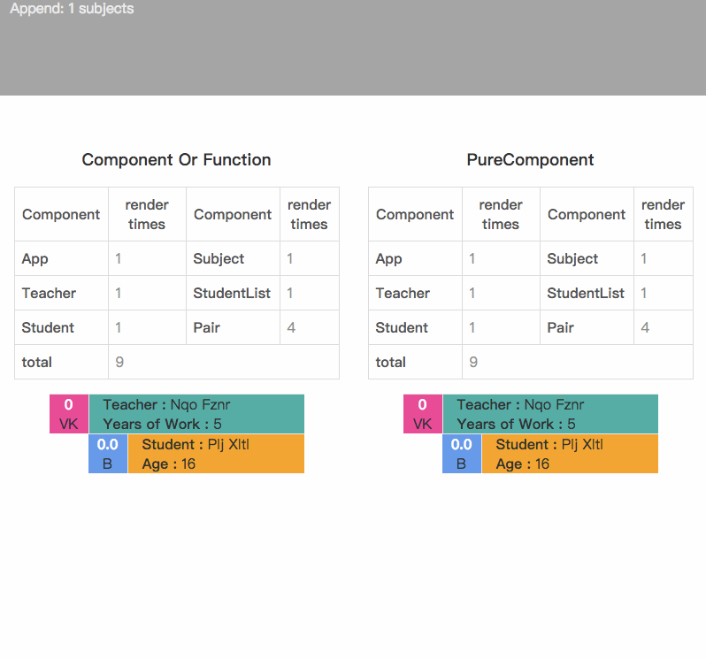

# react-pure-component-example
An example for the React PureComponent.


## Quick Start

```js
$ git clone https://github.com/ipluser/react-pure-component-example.git
$ cd react-pure-component-example
$ npm install
$ npm start
```

See an [online example](http://ipluser.github.io/react-pure-component-example/):

